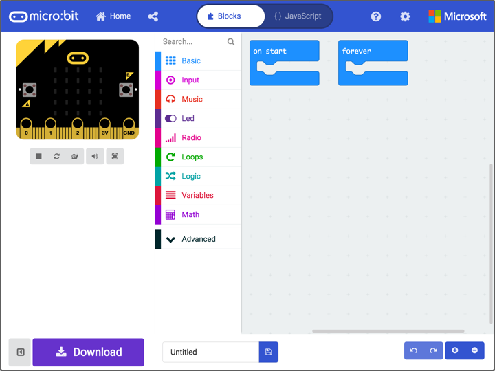
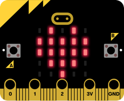
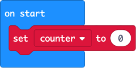
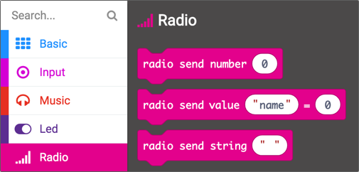
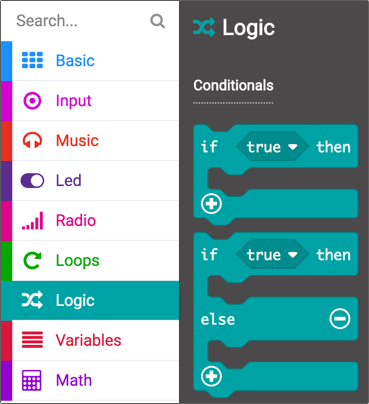
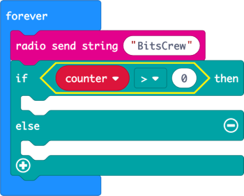

# BBC micro:bit Friend Detector

The [BBC micro:bit](https://amzn.to/2UxQNiM) is a pocket-sized computer that allows you to have loads of fun whilst learning digital technology and computer science. You can program it using block-based coding and build anything - from simple programs to lighti up LEDs to robots, musical instruments and more.

In this tutorial, you will create a friend detector - a wrist-mounted gadget that lights up with a smiley face when your friends are nearby.

## What you will need

* A [BBC micro:bit]((https://amzn.to/2UxQNiM)) - you can buy one from Amazon by following [this link](https://amzn.to/2UxQNiM)
* A computer connected to the internet
* A micro USB cable (if you by the micro:bit Go kit linked above it contains this already). You may need a UBC-C to USB-A adapter if your computer only has USB-C ports (for example modern Macs).
* A micro:bit battery pack and batteries (if you by the micro:bit Go kit linked above it contains this already)
* Some duct tape
* Velcro

## Getting started

* Plug the micro:bit into your computer using the micro USB cable.
  
  

* Open [makecode.microbit.org](https://makecode.microbit.org/) in your browser
  
  

* Select the **New Project** button to start creating a new BBC micro:bit project

  

### The MakeCode editor

The MakeCode editor is where you program your BBC micro:bit, using either blocks or JavaScript. For this tutorial, we'll use blocks.

The editor is split into three sections - the simulator, toolbox and workspace.

#### The simulator

The simulator is a 'virtual micro:bit'. It shows your program running and can be used for debugging your code - that is testing that your code works quickly without having to continuously update the code on your physical micro:bit.

#### The toolbox

The toolbox contains the blocks you can use to create your program. These are divided into groups to keep similar blocks in one place in an easy to find way. For example the blocks for loops are in the *Loops* section, the blocks to control the Bluetooth radio are in the *Radio* section.

#### The workspace

You write your programs using the workspace. Blocks are dragged from the toolbox to the workspace, and once there values on the blocks can be set if needed. You can scroll around the workspace and zoom in and out if needed to see all your program

## Programming the micro:bit

### The on start and forever blocks

When you create a new project, you get a workspace with two blocks - `on start` and `forever`. These are important blocks and provide a basic structure to your program.

* `on start` contains blocks that are run when the micro:bit is turned on. These blocks are run once, and are used for setup code such as configuring the radio or setting up variables

* `forever` contains code that is run repeatedly as long as the micro:bit is powered on. Once all the blocks inside the `forever` block have executed, they are executed again and again.

### Write your first program

> If you have coded the micro:bit before, skip this section and jump to [Building the friend detector](#Building-the-friend-detector).

To ensure everything is working, lets create a simple program to light up the LEDs.

* Expand the *Basic* section of the toolbox
* Drag a `show leds` block to inside the `on start` block on the workspace
  
  

* Select squares in the 5x5 grid inside the `show leds` block to select with LEDs you want turned on. For example, draw a heart.
  
  

You will see the output of this program in the simulator. The LEDs will be lit matching the shape you drew.

### Deploy your first program to a micro:bit

To run your program on a physical micro:bit instead of the simulator, you will need to download it onto the micro:bit.

There are two ways to do this, depending on what browser you are using. From MakeCode, click the cog icon. If you see the *Pair device* option, then you can download directly to your device from MakeCode.

#### Deploy using MakeCode

* Select the *Pair device* option from the cog menu
  
  

* Ensure your micro:bit is plugged in to your computer using a USB cable
* Select **Pair device*
  
  

* A dialog box will popup telling you that MakeCode wants to connect. It will show a list of any USB devices plugged in, including your micro:bit. Select your micro:bit and select **Connect**.
  
  

* Once paired, select the **Download** button on the bottom of the MakeCode screen.

The code will be deployed to the micro:bit, and the micro:bit restarted. The `on start` block will run and the LEDs will light up.

#### Deploy manually

* Select the **Download** button on the bottom of the MakeCode screen
* A file will be downloaded to your downloads folder called `microbit-Untitled.hex`
* Launch Finder on MacOS or Explorer in Windows
* Find your micro:bit, it will be available as an external drive
* Drag the `microbit-Untitled.hex` file from your `Downloads` folder to the micro:bit drive
  
  

The code will be deployed to the micro:bit, and the micro:bit restarted. The `on start` block will run and the LEDs will light up.

 

Congratulations, you have created your first micro:bit program. Now let's build the friend detector. Remove the `show leds` block from the `on start` block so you have a clean workspace.

## Building the friend detector

The friend detector is a wrist-mounted gadget that lights up with a smiley face when your friends are nearby, or shows an X if no friends are detected. To build this gadget, first you need to code up the micro:bit, then you need to make the wrist mount.

### How the friend detector works

Each friend detector sends out a message using the built-in Bluetooth radio, and listens for other micro:bits sending the same message.

The radio only transmits over a short distance, so if the micro:bit detects a message from another micro:bit, then you know that micro:bit is nearby.

### The algorithm

Algorithms are sets of instructions, and you convert from an algorithm into code using MakeCode to program the micro:bit. When designing a program, you start by thinking about what instructions you want the micro:bit to follow.

For the friend detector, if a friend is nearby a smiley face should show, and if no friends are nearby then the display should show an X.

Using the radio, you can detect if a message is received, but you can't directly detect when messages are no longer received. Instead, the simplest way is to use a timer. When a message is received show the smiley face and start a 5 second timer. If another message is received in those 5 seconds, set the timer back to 5 seconds, otherwise if the timer gets down to 0 show an X.

Timers can be created in MakeCode by using a variable that is set, then inside the `forever` block if the variable is greater then 0 take 1 away from the variable. At the end of the `forever` block pause for a second.

The friend detector also needs to send a message, and this can be done in the `forever` block so messages are continually sent.

Breaking this down into steps gives us:

* *At the start*:
  * Set the counter to 0

* *Run forever*:
  * Send a message
  * Check our counter:
    * If the counter is more than 0:
      * Show a smiley face
      * Take 1 away from the counter
    * If the counter is 0
      * Show an X
  * Wait for 1 second

* *If a message is received*:
  * Set the counter back to 5

### Responding to events

The *At the start* part of the algorithm can be created inside the `on start` block, and the *Run forever* part can be created inside the `forever` block, but how can blocks be run when *a message is received*?

There are a few different types of blocks available in the toolbox. Some blocks need to go inside other blocks, and you can see these by the indentation in the top of the blocks, such as the `show leds` block. Others are designed to stand alone and are run when things happen. These blocks have a smooth top.

You've seen two of these stand alone blocks already - `on start` and `forever`. They have smooth tops, cannot be placed inside other blocks and are triggered by *events* - something that causes these to run. In the case of `on start` and `forever`, these are triggered by the underlying code inside the micro:bit, but other blocks can respond to events such as the buttons being pressed, or messages being received by the radio.

### Coding the micro:bit

#### On Start

The first part of our algorithm is:

> * *At the start*:
>   * Set the counter to 0

To create this code we need a variable for our counter, and need to set this to 0 when the micro:bit starts up.

* Select *Variables* from the toolbox
* Select **Make a variable...**
  
  

* Name the variable `counter`

  

* Select **OK**

The *Variables* toolbox will contain a few more items now - a block to use the counter variable, as well as blocks to set or change the value.

* Drag the `set counter to 0` block and drop it in the `on start` block on the workspace

  

#### Forever

The main part of our algorithm is:

> * *Run forever*:
>   * Send a message
>   * Check our counter:
>     * If the counter is more than 0:
>       * Show a smiley face
>       * Take 1 away from the counter
>     * If the counter is 0
>       * Show an X
>   * Wait for 1 second

This code will all be put in the `forever` block.

* Select *Radio* from the toolbox
  
  

* Drag the `radio send string ""` block and drop it inside the `forever` block

* Select the empty string value `" "`. Type inside this to set the value to be something unique to you and your friends. This is your secret code that means your micro:bits will only smile when your friends are around, not just anyone with the same program.

  

To check the counter, you will need a conditional - a block that does different things depending on if a condition is met, such as if a value is the same as another. Conditionals can also have what is known as an *else* block - a block that is run if the condition is not met.

Conditionals are in the *Logic* section of the toolbox.

* Select *Logic* from the toolbox
  
  

* Drag the `if ... else` block inside the `forever` block, below the `radio send string` block

Conditions can be *boolean*, so if a value is true or false. They can also be *comparisons*, comparing two values to see if they are the same, one is larger than the other, or whatever comparison is needed.

The algorithm checks the `counter` variable and has one block if the counter is greater than 0, and another block if the counter is not greater than 0.

The `if ... else` block has a section where you can drag conditionals, and conditionals have sections where you can drag variables.

* Select *Logic* from the toolbox

* Drag the `0 = 0` conditional from the toolbox and drop it over the `true` condition in the `if ... else` block
  
  

* Select *Variables* from the toolbox

* Drag the `counter` block and drop it over the first `0` in the comparison.

* Change the comparison from `=` to `>`. The statement should read `if counter > 0 then`.
  
  

#### Detecting messages

### Making the wrist mount

## Load the project

https://makecode.microbit.org/_g5R6pjVkE290