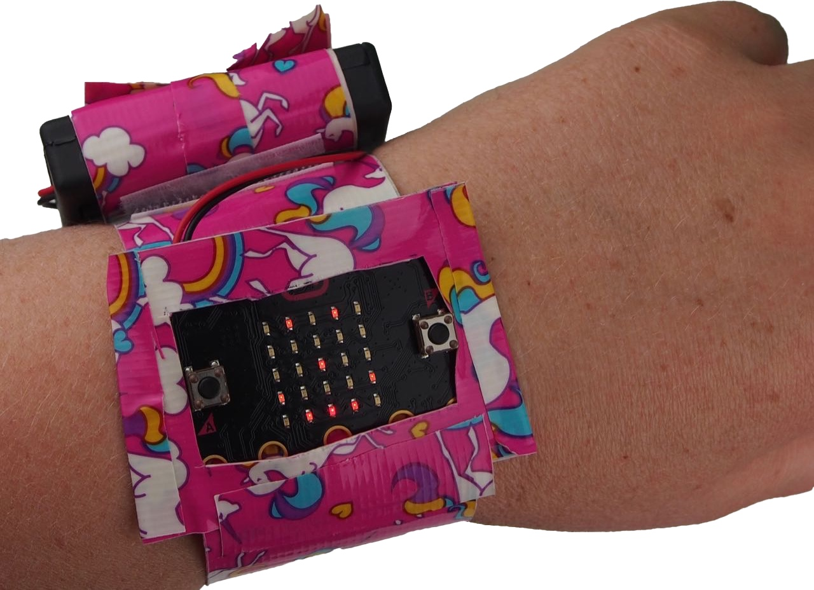

# The friend detector

In the [previous step](./ProgrammingTheMicrobit.md) you wrote your first MakeCode program and ran it on your micro:bit. In this stem you will learn how you will build the friend detector, and look at the algorithm you will need to implement.

## Overview of the friend detector

The friend detector is a wrist-mounted gadget that lights up with a smiley face when your friends are nearby, or shows an X if no friends are detected. To build this gadget, first you need to code up the micro:bit, then you need to make the wrist mount.

## How the friend detector works

Each friend detector sends out a message using the built-in Bluetooth radio, and listens for other micro:bits sending the same message.

The radio only transmits over a short distance, so if the micro:bit detects a message from another micro:bit, then you know that micro:bit is nearby.

## The algorithm

Algorithms are sets of instructions, and you convert from an algorithm into code using MakeCode to program the micro:bit. When designing a program, you start by thinking about what instructions you want the micro:bit to follow.

For the friend detector, if a friend is nearby a smiley face should show, and if no friends are nearby then the display should show an X.

Using the radio, you can detect if a message is received, but you can't directly detect when messages are no longer received. Instead, the simplest way is to use a timer. When a message is received show the smiley face and start a 5 second timer. If another message is received in those 5 seconds, set the timer back to 5 seconds, otherwise if the timer gets down to 0 show an X.

Timers can be created in MakeCode by using a variable that is set, then inside the `forever` block if the variable is greater then 0 take 1 away from the variable. At the end of the `forever` block pause for a second.

The friend detector also needs to send a message, and this can be done in the `forever` block so messages are continually sent.

The radio sends messages using a radio group - only micro:bits using the same group will be able to detect messages from each other, so when the micro:bit starts up, the group needs to be set so that it is the same on all of them.

Breaking this down into steps gives us:

> * *At the start*:
>   * Set the counter to 0
>   * Set the radio group
>
> * *Run forever*:
>   * Send a message
>   * Check our counter:
>     * If the counter is more than 0:
>       * Show a smiley face
>       * Take 1 away from the counter
>     * If the counter is 0
>       * Show an X
>   * Wait for 1 second
>
> * *If a message is received*:
>   * Set the counter back to 5

## Respond to events

The *At the start* part of the algorithm can be created inside the `on start` block, and the *Run forever* part can be created inside the `forever` block, but how can blocks be run when *a message is received*?

There are a few different types of blocks available in the toolbox. Some blocks need to go inside other blocks, and you can see these by the indentation in the top of the blocks, such as the `show leds` block. Others are designed to stand alone and are run when things happen. These blocks have a smooth top.

You've seen two of these stand alone blocks already - `on start` and `forever`. They have smooth tops, cannot be placed inside other blocks and are triggered by *events* - something that causes these to run. In the case of `on start` and `forever`, these are triggered by the underlying code inside the micro:bit, but other blocks can respond to events such as the buttons being pressed, or messages being received by the radio.

In this step you learned how you will build the friend detector, and looked at the algorithm you will need to implement. In the [next step](./OnStartCode.md) you will start writing some code for the first part of the algorithm when the micro:bit starts.
