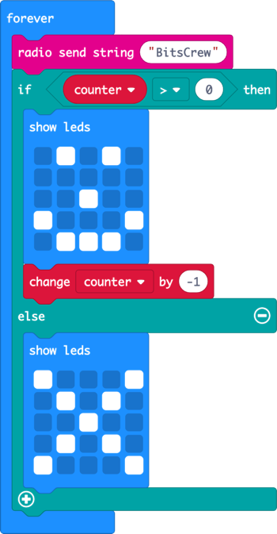

# Code the forever block

In the [previous step](./OnStartCode.md) you started writing some code for the first part of the algorithm when the micro:bit starts. In this step you will write the code that will run in the forever block.

## The algorithm

The main part of our algorithm is:

> * *Run forever*:
>   * Send a message
>   * Check our counter:
>     * If the counter is more than 0:
>       * Show a smiley face
>       * Take 1 away from the counter
>     * If the counter is 0
>       * Show an X
>   * Wait for 1 second

This code will all be put in the `forever` block.

### Send a message

* Select *Radio* from the toolbox
  
  

* Drag the `radio send string ""` block and drop it inside the `forever` block

* Select the empty string value `" "`. Type inside this to set the value to be something unique to you and your friends. This is your secret code that means your micro:bits will only smile when your friends are around, not just anyone with the same program. In the image below, I used the value `BitsCrew`.

  

## Check the counter

To check the counter, you will need a conditional - a block that does different things depending on if a condition is met, such as if a value is the same as another. Conditionals can also have what is known as an *else* block - a block that is run if the condition is not met.

Conditionals are in the *Logic* section of the toolbox.

* Select *Logic* from the toolbox
  
  

* Drag the `if ... else` block inside the `forever` block, below the `radio send string` block
  
  

Conditions can be *boolean*, so if a value is true or false. They can also be *comparisons*, comparing two values to see if they are the same, one is larger than the other, or whatever comparison is needed.

The algorithm checks the `counter` variable and has one block if the counter is greater than 0, and another block if the counter is not greater than 0.

The `if ... else` block has a section where you can drag comparisons, and comparisons have sections where you can drag variables.

* Select *Logic* from the toolbox

* Drag the `0 = 0` comparison block from the toolbox and drop it over the `true` value in the `if ... else` block
  
  

* Select *Variables* from the toolbox

* Drag the `counter` block and drop it over the first `0` in the comparison.
  
  

* Change the comparison from `=` to `>`. The statement should read `if counter > 0 then`.
  
  

### Light the LEDs with a smiley face

If the counter is greater than one, then the LEDs will need to show a smiley face, and the counter will need to count down by 1.

* Select *Basic* from the toolbox

* Drag the `show leds` block into the top part of the conditional so that it is run if the condition is matched

* Select squares in the 5x5 grid to draw a smiley face
  
  

### Reduce the counter by 1

* Select *Variables* from the toolbox

* Drag the `change counter by 1` block to below the `show leds` block

* Select the value to change by and set this to `-1`
  
  

### Light the LEDs with an X

This completes the algorithm for if the `counter` is greater than 0. The logic for if the counter is 0 will go into the `else` part of the `if ... else` block.

* Select *Basic* from the toolbox

* Drag the `show leds` block into the `else` part of the conditional so that it is run if the condition is not matched

* Select squares in the 5x5 grid to draw an X
  
  

## Pause between loops of the forever block

The counter needs to count down the number of seconds, so at the end of the `forever` block it needs to wait one second before this block runs again. Waits use the `pause` block, and these pause for a number of milliseconds - a millisecond being one thousandth of a second.

* Select *Basic* from the toolbox

* Drag the `pause (ms) 100` block into the `forever` block below the `if ... else` block.

* Select the pause time of 100ms. A menu will pop up with other times, so select `1 second`.
  
  

In this step you wrote the code that will run in the forever block. In the [next step](./OnRadioCode.md) you will write the code to detect messages over the radio.