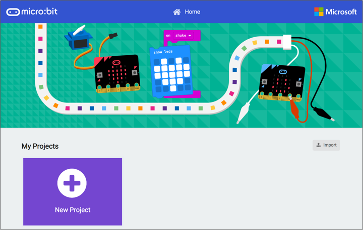
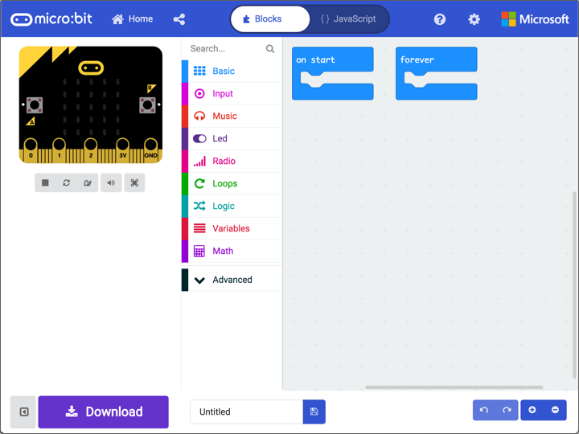
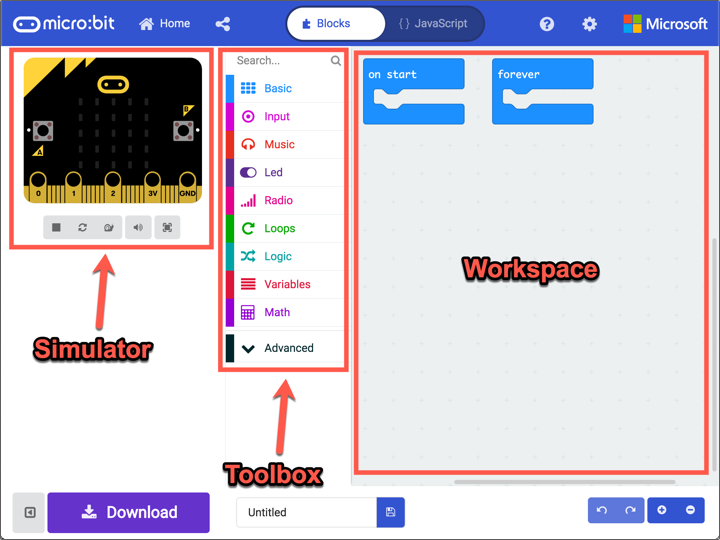

# Get started

In this step you will get started setting up your micro:bit and getting to know MakeCode.

# Get everything ready

* Plug the micro:bit into your computer using the micro USB cable.
  
  

* Open [makecode.microbit.org](https://makecode.microbit.org/) in your browser
  
  

* Select the **New Project** button to start creating a new BBC micro:bit project

  

## Pair your micro:bit

Depending on what browser you are using, you might be able to pair your micro:bit and download code directly onto it. To see if you can do this, from MakeCode, click the cog icon. If you see the *Pair device* option, then you can download directly to your device from MakeCode.

* Select the *Pair device* option from the cog menu
  
  

* Ensure your micro:bit is plugged in to your computer using a USB cable

* Select **Pair device* from the popup
  
  

* A dialog box will popup telling you that MakeCode wants to connect. It will show a list of any USB devices plugged in, including your micro:bit. Select your micro:bit and select **Connect**.
  
  

## The MakeCode editor

The MakeCode editor is where you program your BBC micro:bit, using either blocks or JavaScript. For this tutorial, we'll use blocks.

The editor is split into three sections - the simulator, toolbox and workspace.

### The simulator

The simulator is a 'virtual micro:bit'. It shows your program running and can be used for debugging your code - that is testing that your code works quickly without having to continuously update the code on your physical micro:bit.

### The toolbox

The toolbox contains the blocks you can use to create your program. These are divided into groups to keep similar blocks in one place in an easy to find way. For example the blocks for loops are in the *Loops* section, the blocks to control the Bluetooth radio are in the *Radio* section.

### The workspace

You write your programs using the workspace. Blocks are dragged from the toolbox to the workspace, and once there values on the blocks can be set if needed. You can scroll around the workspace and zoom in and out if needed to see all your program

In this step you set up your micro:bit and got to know MakeCode. In the [next step](./ProgrammingTheMicrobit.md) you will write your first MakeCode program and run it on your micro:bit.