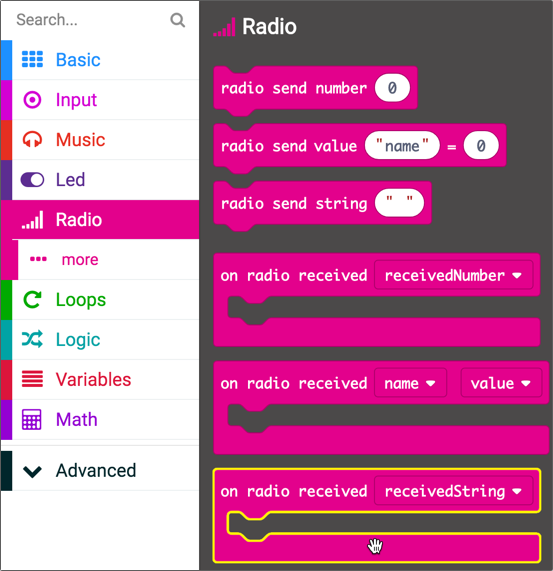
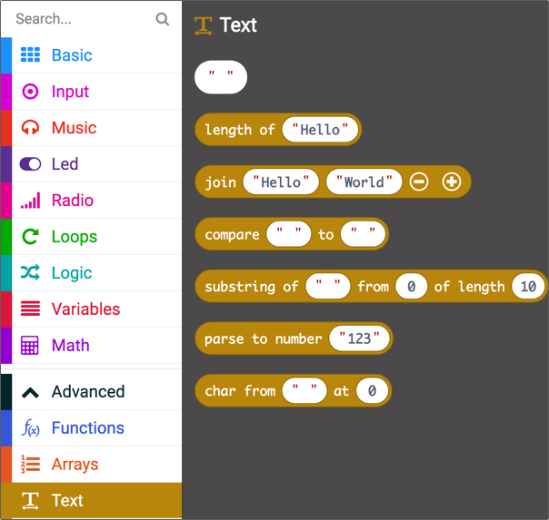
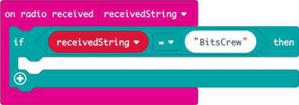
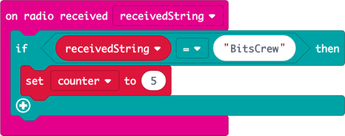

# Detect radio messages

In the [previous step](./ForeverCode.md) you wrote the code that will run in the forever block. In this step you will write the code to detect messages over the radio.

## The algorithm

The message received part of the algorithm is:

> * *If a message is received*:
>   * Set the counter back to 5

To run a block when a message is received, there is an `on radio received` block which can be configured to run only when a specific string value is received.

## Detect messages

* Select *Radio* from the toolbox

* Drag the `on radio received receivedString` block to the workspace. Make sure you drag the `receivedString` block, not the `receivedNumber` block.

  

This block will be run whenever a string value is received by the Bluetooth radio, so the value received needs to be checked against your secret code.

## Compare the message with your code

* Select *Logic* from the toolbox

* Drag an `if` block inside the `on radio received receivedString` block. You just need an `if`, not an `if ... else`.

* Drag the `0 = 0` conditional from the toolbox and drop it over the `true` condition in the `if` block

* Select *Variables* from the toolbox

* Drag `receivedString` over the first `0` value in the conditional

* Expand the *Advanced* section of the toolbox, and select *Text*

  

* Drag the `" "` block over the second `0` value in the conditional

* Select the `" "` value and type in your secret code
  
  

## Reset the timer

If the string value matches your secret code, reset the timer counter back to 5 seconds.

* Select the *Variables* section of the toolbox

* Drag the `set <something> to 0` block to inside the `if` block. Depending on what was last selected in the workspace, this block may show `set receivedString to 0` or `set counter to 0`.

* If the value being set is not `receivedString`, select the value to drop down the popup menu and select `counter`

* Select the value being set and update it to `5`

  

In this step you wrote the code to detect messages over the radio. In the [next step](./RunTheCode.md) you will run the code on multiple micro:bits and test that it works.