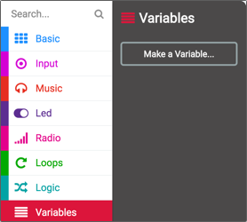
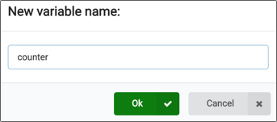
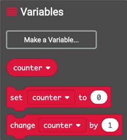
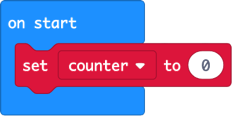
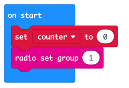

# Code the on start

In the [previous step](./Algorithm.md) you learned how you will build the friend detector, and looked at the algorithm you will need to implement. In this step you will start writing some code for the first part of the algorithm when the micro:bit starts.

## On Start

The first part of our algorithm is:

> * *At the start*:
>   * Set the counter to 0
>   * Set the radio group

To create this code we need a variable for our counter, and need to set this to 0 when the micro:bit starts up, along with setting the radio group.

## Create and set the counter

* Select *Variables* from the toolbox
* Select **Make a variable...**
  
  

* Name the variable `counter`

  

* Select **OK**

The *Variables* toolbox will contain a few more items now - a block to use the counter variable, as well as blocks to set or change the value.

* Drag the `set counter to 0` block and drop it in the `on start` block on the workspace

  

## Set the radio group

* Select *Radio* from the toolbox
* Drag the `radio set group` block and drop it in the `on start` block on the workspace, below the `set counter to 0` block.
* Make sure the radio group in the `radio set group` block is set to `1`. If not, select the value in the `radio set group` block and use the slider that appears to change the value to 1.

  

In this step you started writing some code for the first part of the algorithm when the micro:bit starts. In the [next step](./ForeverCode.md) you will write the code that will run in the forever block.