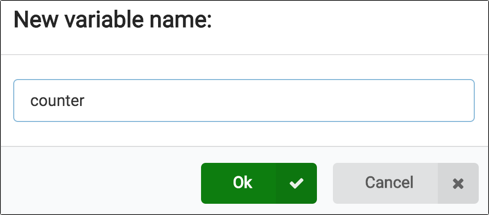

# Code the on start

In the [previous step](./Algorithm.md) you learned how you will build the friend detector, and looked at the algorithm you will need to implement. In this step you will start writing some code for the first part of the algorithm when the micro:bit starts.

## On Start

The first part of our algorithm is:

> * *At the start*:
>   * Set the counter to 0

To create this code we need a variable for our counter, and need to set this to 0 when the micro:bit starts up.

* Select *Variables* from the toolbox
* Select **Make a variable...**
  
  

* Name the variable `counter`

  

* Select **OK**

The *Variables* toolbox will contain a few more items now - a block to use the counter variable, as well as blocks to set or change the value.

* Drag the `set counter to 0` block and drop it in the `on start` block on the workspace

  

In this step you started writing some code for the first part of the algorithm when the micro:bit starts. In the [next step](./ForeverCode.md) you will write the code that will run in the forever block.