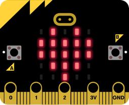

# Write your first micro:bit program

In the [previous step](./GettingStarted.md) you set up your micro:bit and got to know MakeCode. In this step you will write your first MakeCode program and run it on your micro:bit.

## The on start and forever blocks

When you create a new project, you get a workspace with two blocks - `on start` and `forever`. These are important blocks and provide a basic structure to your program.

* `on start` contains blocks that are run when the micro:bit is turned on. These blocks are run once, and are used for setup code such as configuring the radio or setting up variables

* `forever` contains code that is run repeatedly as long as the micro:bit is powered on. Once all the blocks inside the `forever` block have executed, they are executed again and again.

## Write your first program

> If you have coded the micro:bit before, skip this section and jump to [Building the friend detector](./GettingStarted.md#Building-the-friend-detector).

To ensure everything is working, lets create a simple program to light up the LEDs.

* Expand the *Basic* section of the toolbox
* Drag a `show leds` block to inside the `on start` block on the workspace
  
  

* Select squares in the 5x5 grid inside the `show leds` block to select with LEDs you want turned on. For example, draw a heart.
  
  

You will see the output of this program in the simulator. The LEDs will be lit matching the shape you drew.

## Deploy your first program to a micro:bit

To run your program on a physical micro:bit instead of the simulator, you will need to download it onto the micro:bit.

### Deploy using MakeCode

If you were able to pair your device with MakeCode:

* Select the **Download** button on the bottom of the MakeCode screen.

The code will be deployed to the micro:bit, and the micro:bit restarted. The `on start` block will run and the LEDs will light up.

### Deploy manually

If you were not able to pair your device with MakeCode:

* Select the **Download** button on the bottom of the MakeCode screen
* A file will be downloaded to your downloads folder called `microbit-Untitled.hex`
* Launch Finder on MacOS or Explorer in Windows
* Find your micro:bit, it will be available as an external drive
* Drag the `microbit-Untitled.hex` file from your `Downloads` folder to the micro:bit drive
  
  

The code will be deployed to the micro:bit, and the micro:bit restarted. The `on start` block will run and the LEDs will light up.

## Run the app

Congratulations, you have created your first micro:bit program. Now let's build the friend detector. Remove the `show leds` block from the `on start` block so you have a clean workspace.

In this step you wrote your first MakeCode program and ran it on your micro:bit. In the [next step](./Algorithm.md) you will learn how you will build the friend detector, and look at the algorithm you will need to implement.
