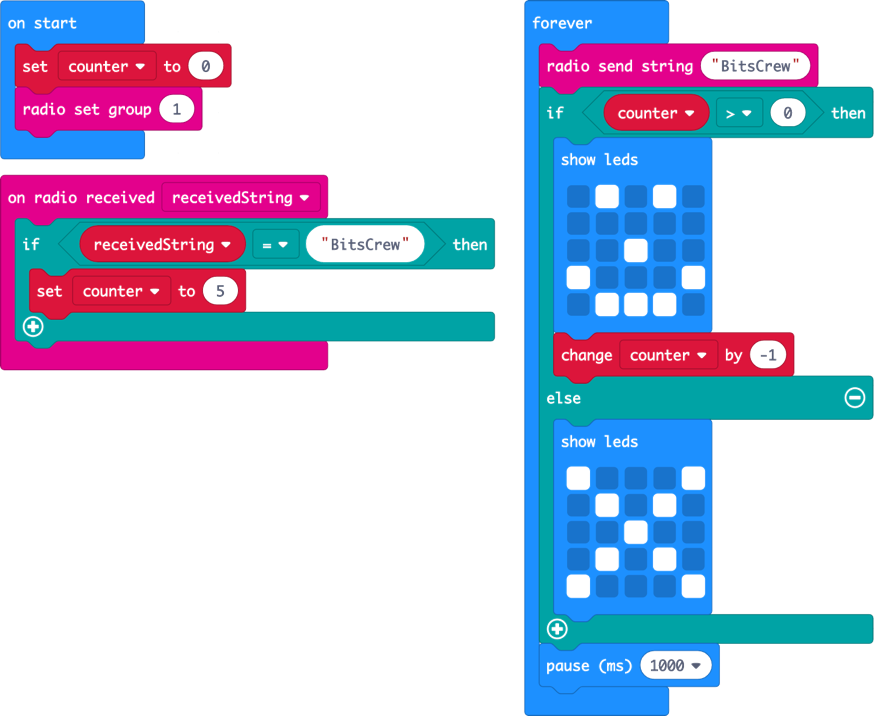

# Run the code

In the [previous step](./OnRadioCode.md) you wrote the code to detect messages over the radio. In this step you will run the code on multiple micro:bits and test that it works.

## Check your code

Your workspace should look like this - with a different secret key.

The simulators will show two micro:bits. MakeCode will detect that your program relies on multiple micro:bits talking to each other over the radio so will show two devices, each one with a smiley face.

## Run your code

* Select the **Download** button.

If you paired your micro:bit earlier then the code will be pushed to your micro:bit and it will be restarted.
If you haven't paired your micro:bit, or are using a browser that doesn't allow you to pair:

* Select the **Download** button on the bottom of the MakeCode screen
* A file will be downloaded to your downloads folder called `microbit-Untitled.hex`
* Launch Finder on MacOS or Explorer in Windows
* Find your micro:bit, it will be available as an external drive
* Drag the `microbit-Untitled.hex` file from your `Downloads` folder to the micro:bit drive

Deploy the code to more than one micro:bit, and connect the micro:bits to battery packs.

## Test your code

Once your code is running on multiple micro:bits, you should see smiley faces on both as they will be close together. To test having the smiley faces change to an X:

* Turn one micro:bit off. After 5 seconds the other should show an X
* Move one micro:bit away from the other. Bluetooth has a long range, so you may need to move a long way away - the distance depends on what else is between the micro:bits, such as walls and people.

## Change the range

If you want to change the range of the detector - for example to only make it work at close range, you can do this by changing the signal strength of the Bluetooth radio. The lower the strength, the closer the micro:bits have to be to pick up the message.

* Select the *Search* box at the top of the toolbox. By searching you can find blocks that are not available from the normal sections.
  
* Type `power` to filter the items

* Drag the `radio set transmit power 7` block to the `on start` block

* Change the power to suit.

The power can be set from 0 to 7, 0 being the weakest, 7 the strongest. The lower the number, the closer the micro:bits need to be to detect each other.

Try changing this number and testing different distances.

In this step you ran the code on multiple micro:bits and tested that it works. In the [next step](./WristBand.md) you will build a wrist band for your friend detector.