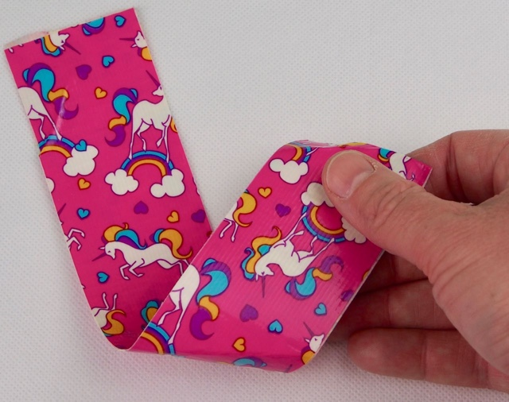
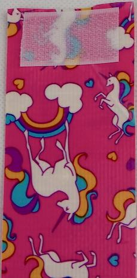
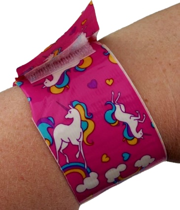
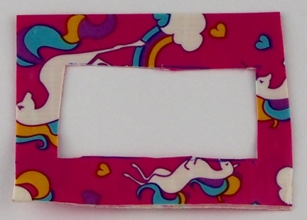
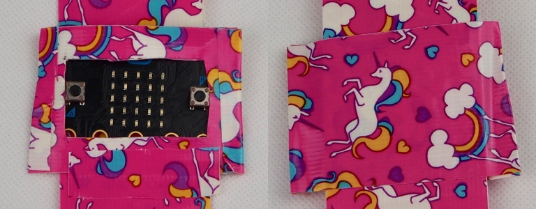
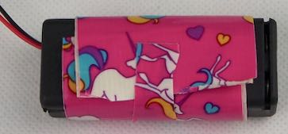
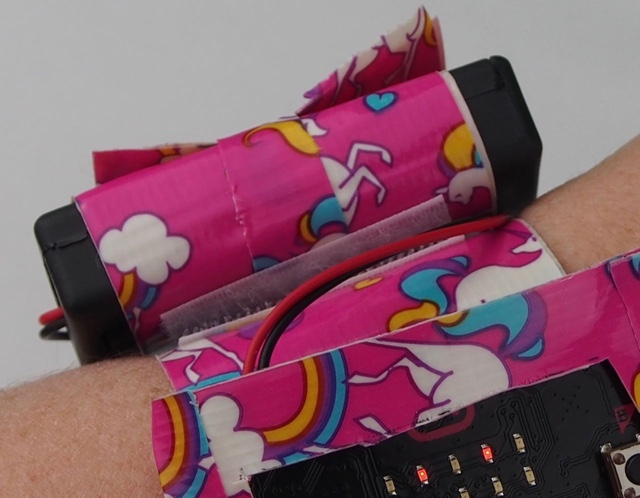

# Build a wrist band

In the [previous step](./RunTheCode.md) you ran the code on multiple micro:bits and tested that it works. In this step you will build a wrist band for your friend detector.

## Construction outline

The wrist strap consists of:

* A strap that wraps around your wrist, held in place with velcro

* A holder for the battery pack

* A holder for the micro:bit with a window in the top to see the display

### Make the strap

The strap is made of duct tape. Most duct tape is a boring grey or black color, but you can get more colorful ones such as [rainbow](https://amzn.to/2XLnFGN) or [unicorns](https://amzn.to/2GLcUPc).

* Roughly measure out one 50cm strip of duct tape

* Fold the tape in half, sticky side on the inside so you have one 25cm length with the non-sticky sides on the outside to make a wrist strap

  

* Stick a small square of sticky velcro to one end of the wrist strap
  
  

* Peel the backing off the other side of the velcro and wrap the strap around your wrist, sticking the other end to the sticky velcro. This will give you a wrist strap that is held in place by the velcro.

  

* Trim off any excess on the end of the wrist strap

### Make the micro:bit holder

* Cut a 13cm piece of duct tape and fold in half, sticky side to sticky side

* Draw a rectangle in the middle of the tape, one centimeter from the edge all the way round

* Cut the rectangle out and fit the piece over the LED side of your micro:bit. The buttons should just fit inside the hole, so make it larger if necessary
  
  

* Put the micro:bit and cover on the middle of the wrist strap

* Use an 8cm length of duct tape to fix the micro:bit and cover to the strap. Stick one end to the edge of the micro:bit holder, wrap it around the back of the wrist strap and stick it to the other end of the holder

* Use a small piece of duct tape to stick down the bottom of the micro:bit holder. Leave the top open
  
  

### Make the battery holder

* Cut an 18cm piece of duct tape and fold in half, sticky side to sticky side

* Wrap this around the battery pack and use a small piece of duct tape to fix down the end.
  
  

* Fix the battery pack to the wrist strap using sticky velcro
  
  

## Detect your friends

Your friend detector is finished. Strap it to your wrist and have fun!